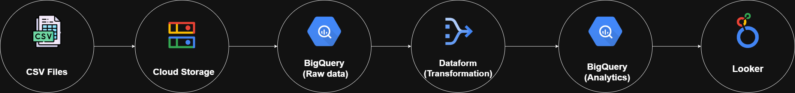
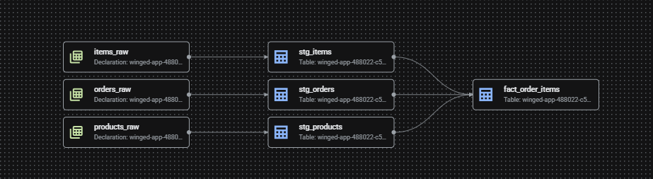
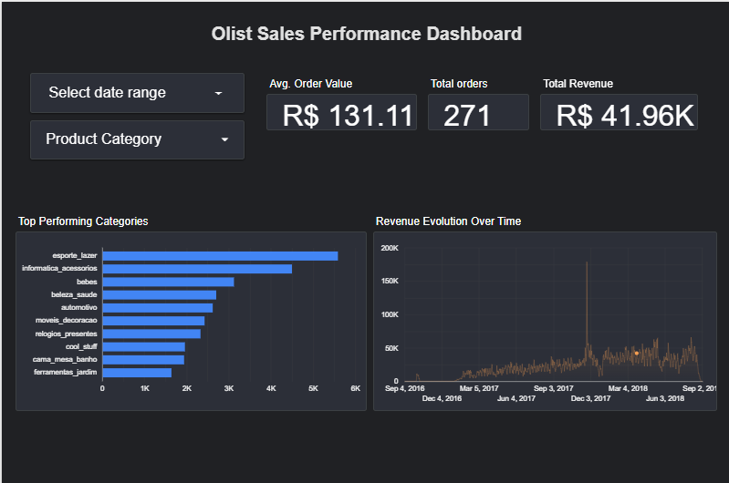

# Phase 3: Production Cloud ELT Pipeline (GCP & Looker Studio)

> **The final phase of the Olist Trilogy: A production-ready Cloud infrastructure focused on scalability, automation, and cost-efficiency.**

---

## 🔄 The Olist Data Journey
This project is the culmination of a 3-part series demonstrating my growth from local scripts to enterprise cloud architecture:
1. **[Phase 1: Python/SQL Foundation](https://github.com/ZinelabidineCh/olist-python-sql-foundation)** (Local EDA & Scripting)
2. **[Phase 2: Strategic BI Dashboard](https://github.com/ZinelabidineCh/olist-bi-powerbi-analytics)** (Data Modeling & Power BI)
3. **Phase 3: Production Cloud Pipeline** (GCP Infrastructure)

---

## 🏗️ Architecture & Tech Stack
Unlike previous phases, this architecture moves away from manual execution to a **Modern Data Stack (MDS)** approach.

* **Ingestion:** Raw CSV data stored in **Google Cloud Storage (GCS)**.
* **Storage:** **Google BigQuery** (Multi-tier: `olist_raw_data` for staging and `olist_analytics` for production).
* **Transformation:** **Dataform (SQLX)** for modular ELT and dependency management.
* **Optimization:** Advanced Table Partitioning and Clustering for performance.
* **Visualization:** **Looker Studio** for real-time cloud-native reporting.

---

## 🛠️ Dataform Workflow & Lineage
Using Dataform allowed me to treat data transformations like software code (Version Control + Testing):

1.  **Staging Layer:** Cleaned raw strings, cast types (Prices to `FLOAT64`, Dates to `TIMESTAMP`), and standardized schema names.
2.  **Quality Control:** Integrated **Dataform Assertions** (Unit Tests) to verify that critical columns like `order_id` were unique and non-null before reaching the Analytics layer.
3.  **Analytics Layer:** Joined multiple sources into a centralized, high-performance `fact_order_items` table.

---

## ⚡ Performance & Cost Optimization
In a cloud environment, efficiency equals savings. I implemented:
* **Partitioning:** The `fact_order_items` table is partitioned by `purchase_at` (Day), reducing query costs by up to 90% when filtering by date.
* **Clustering:** Data is clustered by `product_category_name`, ensuring that Looker Studio filters respond instantly.

---

## 📊 Business Insights (Looker Studio)
The final dashboard provides a real-time, cloud-connected view of:
* **Financials:** Total Revenue, Average Order Value (AOV), and Sales Volume.
* **Trends:** Monthly revenue evolution tracking growth patterns.
* **Category Analysis:** Identification of top-performing product segments.

---

## 🛠️ Troubleshooting & Technical Challenges

### 1. Data Type Mismatch (The "String" Trap)
* **Issue:** Raw ingestion into BigQuery defaulted all columns to `STRING`, breaking mathematical aggregations.
* **Solution:** Implemented explicit `CAST` functions in the Dataform staging layer.
* **Impact:** Restored the ability to perform financial calculations (Revenue, Growth %).

### 2. Dashboard Aesthetic & Metric Accuracy
* **Issue:** Initial scorecards showed confusing decimal places (e.g., "271.0" orders) and lacked currency context.
* **Solution:** Normalized decimal precision to `0` for counts and applied **BRL Currency formatting** for financial KPIs.

### 3. Dataform Dependency Management
* **Issue:** Tables frequently failed during execution because they attempted to populate before the source tables existed.
* **Solution:** Used the `ref()` function in SQLX to build a **Directed Acyclic Graph (DAG)**, ensuring a perfect execution sequence.

### 4. BigQuery Cost & Performance Optimization
* **Issue:** Standard queries on large datasets can be expensive if they scan the whole table every time.
* **Solution:** Implemented **Partitioning** on the `purchase_at` column. This forces BigQuery to only scan the specific data "shards" requested by the Looker Studio date filter.

---
*Author: Zinelabidine Chiguer*
